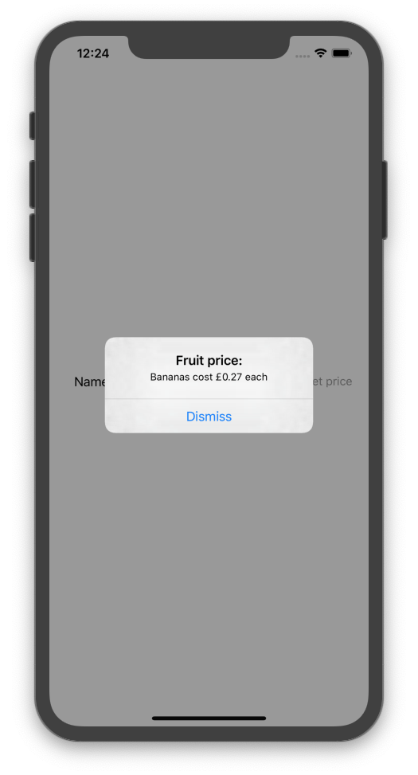

#iOS Client

In this guide we are going to create a simple iOS application that uses a KituraKit client to interact with a Kitura server.  The app we are going to make will be simple and holds a list of fruit that you can scroll through.  Upon selecting a desired fruit, we will send a GET request to a server that will return the price of the selected fruit.

---

##Setting up your server

If you don't have a server, follow our Create a Server guide.

Kitura and KituraKit send and receive instances of Swift types directly. These types (aka models) can be shared between the client and server.

Firstly, we need to create a Fruit model.  Create a new file, called Fruit.swift:

```
touch Sources/Application/Models/Fruit.swift
```

Open your Fruit.swift file:

```
open Sources/Application/Models/Fruit.swift
```

The only requirement for a model is that it conforms to the Codable protocol:

```swift
public struct Fruit: Codable {
    public let name: String
    public let price: Double
    public init(name: String, price: Double) {
        self.name = name
        self.price = price
    }
}
```

We need to add a file for our fruit routes.  Open your Application.swift file in your default text editor:

```
open Sources/Application/Application.swift
```

Inside the postInit() function add:

```swift
initializeFruitRoutes(app: self)
```

Create a new file, called FruitRoutes.swift:

```
touch Sources/Application/Routes/FruitRoutes.swift
```

Open your FruitRoutes.swift file:

```swift
open Sources/Application/Routes/FruitRoutes.swift
```

Inside this file, add the following code:

```swift
import Foundation
import KituraContracts

func initializeFruitRoutes(app: App) {

}
```

This code imports our required modules and sets up the framework for a routes page.

Firstly, we're going to create a String to Double dictionary that holds all the names for fruit in our list and their corresponding prices.  Inside the scope of our initializeFruitRoutes function add this code:

```swift
var fruitDict: [String:Double] = [:]
fruitDict = ["Apple": 0.35,
               "Banana": 0.27,
               "Orange": 0.29,
               "Pear": 0.18,
               "Watermelon": 1.79,
               "Mango": 0.68,
               "Pineapple": 1.49,
               "Lemon": 0.45,
               "Kiwi": 0.78,
               "Grapefruit": 0.64]
```

After we have done this, we will register a GET route on the router to the "/fruit" path.  We will want this to take the fruit name as a String, to get the corresponding value and return the Fruit object containing both the fruit name and its price.  Add this code after the dictionary:

```swift
app.router.get("/fruit") { (fruitName: String, completion: (Fruit?, RequestError?) -> Void) in
    let fruitPrice = fruitDict[fruitName]
    let fruitObject = Fruit(name: fruitName, price: fruitPrice!)
    completion(fruitObject, nil)
  }
```

Your finished FruitRoutes.swift file should look like so:

```swift
import Foundation
import KituraContracts

func initializeFruitRoutes(app: App) {

    var fruitDict: [String:Double] = [:]
    fruitDict = ["Apple": 0.35,
                   "Banana": 0.27,
                   "Orange": 0.29,
                   "Pear": 0.18,
                   "Watermelon": 1.79,
                   "Mango": 0.68,
                   "Pineapple": 1.49,
                   "Lemon": 0.45,
                   "Kiwi": 0.78,
                   "Grapefruit": 0.64]

    app.router.get("/fruit") { (fruitName: String, completion: (Fruit?, RequestError?) -> Void) in
        let fruitPrice = fruitDict[fruitName]
        let fruitObject = Fruit(name: fruitName, price: fruitPrice!)
        completion(fruitObject, nil)
    }
}
```

##Setting up your iOS app

Open Xcode and select File > New > Project and select new iOS Single View App.  Name the product name FruitApp, enter your organization identifier as your name and select Storyboard as the option for your user interface.  Select the directory where you would like your app to be situated, then click create.

###Adding KituraKit using CocoaPods

Before we begin creating the app, open a terminal window and navigate to where your .xcodeproj file is and enter the following code:

```
pod init
```

This will create the podfile for our app, open the podfile in your default text editor and add the following code beneath `# Pods for FruitApp`:

```
pod 'KituraKit'
```

Save the file, close Xcode and run:

```
pod install
```

You will notice that an .xcworkspace file has been generated, from now on we will be using this file when creating the app.

###Creating the user interface

Open FruitApp.xcworkspace in Xcode and navigate to the Main.storyboard file, click on this file and you should see a blank iPhone screen.  At the top right of the Xcode window you should see a plus symbol on a button, this is the library for the user interface.  Click on this button and add a label, picker view and button individually so that it looks like this:


Once you have set up your interface, in the top bar, click Editor > Assistant so that your Xcode has the Main.storyboard and ViewController.swift file showing.

Now, hold control, click on the UIPIckerView and drag it into the ViewController class naming it itemName.  Then do the same for the Button, naming it priceButton.

> Make sure to select outlet as the option for type of connection.

Finally, click on the Button and drag it into the ViewController class after the viewDidLoad function, this time select Action for the type of connection, select the sender to be UIButton and name it getPriceAction:

###Adding functionality

Firstly, open the info.plist file in your preferred text editor and add this anywhere in the first dictionary declaration:
```
<key>NSAppTransportSecurity</key>
<dict>
  <key>NSAllowsArbitraryLoads</key>
  <true/>
</dict>
```

Now we can begin adding functionality to our app, we need to copy and paste the Fruit.swift file that we created earlier in our server, into a new Fruit.swift file:

```swift
import Foundation

public struct Fruit: Codable {
    public let name: String
    public let price: Double
    public init(name: String, price: Double) {
        self.name = name
        self.price = price
    }
}
```

Then go back to our ViewController.swift file and add these to our import statements:

```swift
import UIKit
import KituraKit
import KituraContracts
import Dispatch
```

Now, add UIPickerViewDelegate and UIPickerViewDataSource as conformities for the ViewController so that it looks like this:

```swift
class ViewController: UIViewController, UIPickerViewDelegate, UIPickerViewDataSource {
```

After this, create two variables, we will use these later on:
```swift
var valueSelected: String = "Apple"
var pickerData: [String] = [String]()
```

Inside the scope of the viewDidLoad function, we need to add the data for the UIPickerView to display:

```swift
self.itemName.delegate = self
self.itemName.dataSource = self

pickerData = ["Apple", "Banana", "Orange", "Pear", "Watermelon", "Mango", "Pineapple", "Lemon", "Kiwi", "Grapefruit"]
```

In order to get the selected value from the UIPickerView, we have to include several functions. after the viewDidLoad() function, add:

```swift
func numberOfComponents(in pickerView: UIPickerView) -> Int {
    return 1
}

func pickerView(_ pickerView: UIPickerView, numberOfRowsInComponent component: Int) -> Int {
    return pickerData.count
}

func pickerView(_ pickerView: UIPickerView, titleForRow row: Int, forComponent component: Int) -> String? {
    return pickerData[row]
}

func pickerView(_ pickerView: UIPickerView, didSelectRow row: Int, inComponent component: Int) {
    valueSelected = pickerData[row] as String
}
```

Now, when using the variable valueSelected, it will return the value that is currently selected on the UIPickerView.

> valueSelected has an initial default value set to Apple, the first fruit in our list.

Inside the scope of the getPriceAction function we will now set up the client side of our application.  Firstly we will create a client object:

```swift
if let client = KituraKit(baseURL: "http://localhost:8080") {

}
```

Inside this if statement, we will declare our GET route, which has an identifier of valueSelected and expects a Fruit object returned:

```swift
client.get("/fruit", identifier: valueSelected) { (returnedFruit: Fruit?, error: RequestError?) -> Void in
}
```

With the returned fruit, we will create an alert that will tell the user how much one of their selected fruit costs

```swift
let alert = UIAlertController(title: "Fruit price:", message: "\(returnedFruit!.name)s cost £\(returnedFruit!.price) each", preferredStyle: UIAlertController.Style.alert)
alert.addAction(UIAlertAction(title: "Dismiss", style: .default))
```

Finally, we need to present this alert in the view:

```swift
DispatchQueue.main.async {
    self.present(alert, animated: true, completion: nil)
}
```

> Any code that changes the view has to be executed on the main thread, this is why we have to use DispatchQueue.main.async.

Congratulations!  If you have followed everything correctly, your ViewController.swift file should look like this:

```swift
import UIKit
import KituraKit
import KituraContracts
import Dispatch

class ViewController: UIViewController, UIPickerViewDelegate, UIPickerViewDataSource {


    @IBOutlet weak var nameLabel: UILabel!
    @IBOutlet weak var itemName: UIPickerView!
    @IBOutlet weak var priceButton: UIButton!

    var valueSelected: String = "Apple"

    var pickerData: [String] = [String]()

    override func viewDidLoad() {
        super.viewDidLoad()
        // Do any additional setup after loading the view.

        self.itemName.delegate = self
        self.itemName.dataSource = self

        pickerData = ["Apple", "Banana", "Orange", "Pear", "Watermelon", "Mango", "Pineapple", "Lemon", "Kiwi", "Grapefruit"]
    }

    func numberOfComponents(in pickerView: UIPickerView) -> Int {
        return 1
    }

    func pickerView(_ pickerView: UIPickerView, numberOfRowsInComponent component: Int) -> Int {
        return pickerData.count
    }

    func pickerView(_ pickerView: UIPickerView, titleForRow row: Int, forComponent component: Int) -> String? {
        return pickerData[row]
    }

    func pickerView(_ pickerView: UIPickerView, didSelectRow row: Int, inComponent component: Int) {
        valueSelected = pickerData[row] as String
    }

    @IBAction func getPriceAction(_ sender: UIButton) {
        if let client = KituraKit(baseURL: "http://localhost:8080") {
            // Use client to make requests here
            client.get("/fruit", identifier: valueSelected) { (returnedFruit: Fruit?, error: RequestError?) -> Void in
                let alert = UIAlertController(title: "Fruit price:", message: "\(returnedFruit!.name)s cost £\(returnedFruit!.price) each", preferredStyle: UIAlertController.Style.alert)
                alert.addAction(UIAlertAction(title: "Dismiss", style: .default))
                DispatchQueue.main.async {
                    self.present(alert, animated: true, completion: nil)
                }
            }
        }
    }
}
```

##Test your app

Now everything is set up, run your server project and your iOS project to test your app!  This is an example of what your app should look like when returning a fruit price:



You have now successfully created a front end in iOS using a KituraKit client and a corresponding back end on a server using Kitura!
