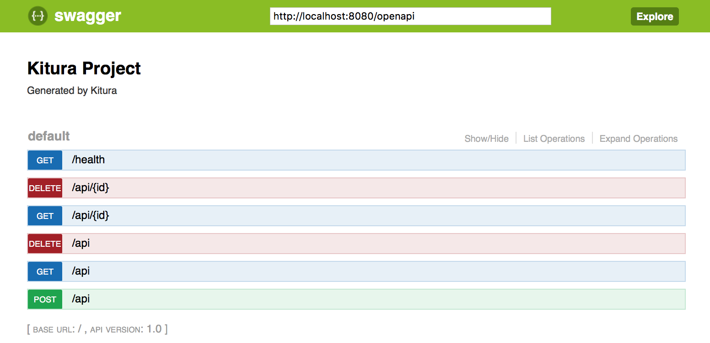
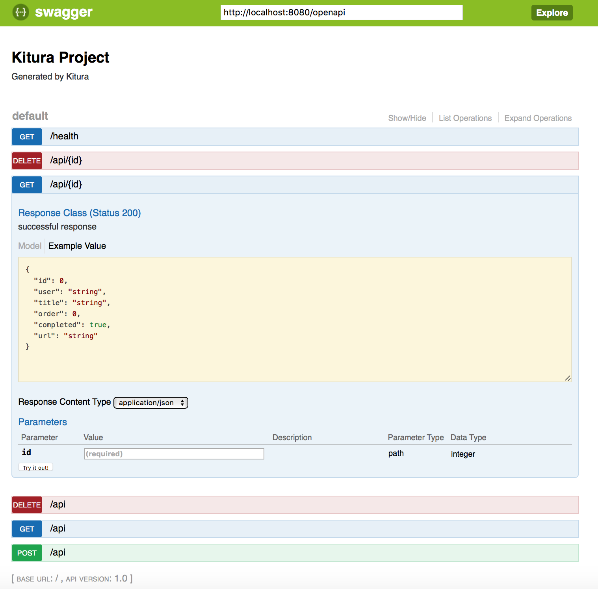
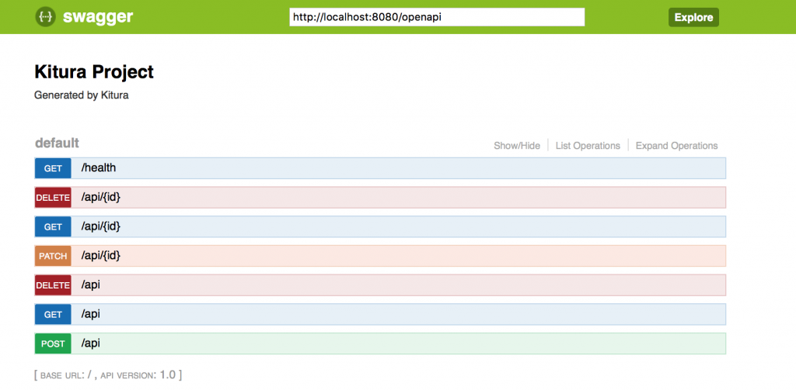

OpenAPI is the most popular way to document RESTful APIs. It allows developers to define interface specifications in a structured machine readable format. These specifications can be both generated and consumed by tools that help in the building of verifiable interfaces. It can make development faster too!

Kitura 2.4 now includes a feature that allows you to view the OpenAPI specification of your Kitura application. Kitura can expose an OpenAPI document that describes the application interfaces that are defined in your application as Codable routes. Change your application, recompile, and the OpenAPI document will reflect those changes!

At first this might not seem that exciting, however, integrate it with some extra tooling and this can turn into a powerful development tool.

So how do you see this OpenAPI document? First, there are a few steps needed to integrate OpenAPI tooling into your application…

- import KituraOpenAPI into your application:

```swift
import KituraOpenAPI
```

- Add a call to add API endpoints from the router into KituraOpenAPI. The call should go in your application startup code – perhaps your init() method:

```swift
public init() throws {
    KituraOpenAPI.addEndpoints(to: router)
}
```

- Add Kitura-OpenAPI.git as a dependency in your Package.swift:

```swift
.package(url: "https://github.com/IBM-Swift/Kitura-OpenAPI.git", from: "1.0.0"),
```

- Then update your dependencies by running `swift package update`.

Now go ahead, recompile and restart the application and you should be able to view the SwaggerUI page: http://localhost:8080/openapi/ui as this will present an API Explorer that is populated from the OpenAPI document, so it shows the routes you have configured in the currently running application.



One click on a route will expand it so you can see what arguments it takes, what results it can return and a status code, but better still, you can click the “Try it out!” button to exercise that API immediately:



Now add a new route to your code (in this example I’m adding the patch route at the end):



You add a new API or add business logic? All you need do is recompile, run the application, visit SwaggerUI, and test your API immediately.

So there you have it. A rapid development lifecycle that allows a quick deploy/test cycle for your APIs.
