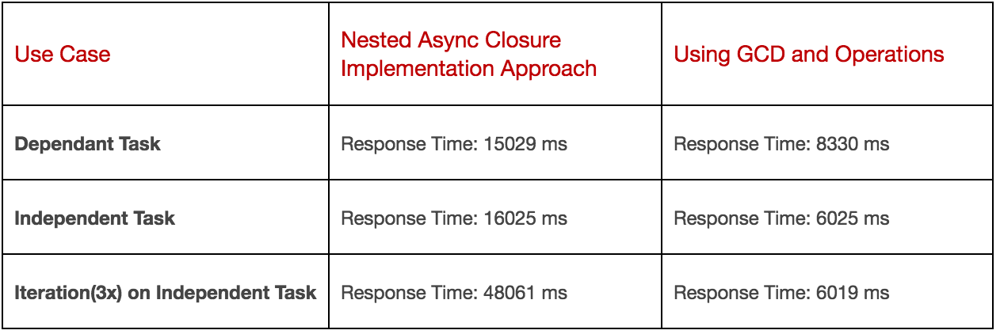

In enterprise businesses, microservices are designed according to best architectural practice and implemented to deliver the business solution in the form of services. These services are often consumed by HTTP REST API calls. In this blog, I will explain how to approach asynchronous programming on server-side Swift using [Grand Central Dispatch (GCD) and OperationQueue](https://developer.apple.com/library/content/documentation/General/Conceptual/ConcurrencyProgrammingGuide/OperationQueues/OperationQueues.html).

In general, the backend microservices execute heavy CPU intensive or I/O processes such as DB CRUD operations, component level communication, processing of media files etc. In iOS side Swift programming, it’s general practice to make use of closures and call back methods to make asynchronous calls. Server-side Swift programming allows developers to use the same closure and call back methods without any limitations for asynchronous tasks. However, when compared to iOS programming, the server-side API code can require significantly more asynchronous calls in a single module block. This leads to multiple call back closures and nested async code. An alternate native solution is to make use of GCD and OperationQueue methods. There are some open source Swift libraries, such as [PromiseKit](https://github.com/mxcl/PromiseKit) to handle complex functions, which use GCD and OperationQueue concepts under the hood, but this article is going to show you a native way of coding this yourself.

I explain the solution and its benefits with a simple example below using [Kitura](https://github.com/Kitura/Kitura).

---

##CPU Intensive Processes

```
Let's name these processes to refer in our example codes and add a 'time to execute' weight in terms of seconds. P1 = 3 sec, P2 = 4 sec, P3 = 2 sec, P4 = 6 sec, P5 = 1 sec
```

These functions are simulated using the sleep method to consume a few seconds of execution time and are defined as:

```swift
func p1(_ onCompletion: @escaping (_ output:String)-> Void) {
    sleep(3)
    onCompletion("p1")
}

func p2(_ onCompletion: @escaping (_ output:String)-> Void) {
    sleep(4)
    onCompletion("p2")
}
...
```

---

##Implementation Scenario

In our example, we construct a HTTP GET API, say /dataIntensiveJob, that requires all of the above processes from P1 – P5. These processes can be dependent or independent and the module can be programmed with nested asynchronous closures or using GCD. This means we have four types of implementation:

* “/dataIntensiveJobAsync/independent”
* “/dataIntensiveJobGCD/independent”
* “/dataIntensiveJobAsync/dependent”
* “/dataIntensiveJobGCD/dependent”

##1. Independent Task with Traditional Nested Async Closure Blocks

Typically, the module here requires a set of independent tasks to be completed. To avoid blocking the main thread, they can be programmed to run in multiple async blocks irrespective of order. Also, since there is no mechanism in place to notify about completion of all the tasks, operations could be sequenced in a nested async block. Hence, the completion of all the tasks is identified by completion of the innermost block.

```swift
func executeIndependentHeavyProcesses(_ onCompletion: @escaping (_ outputMessage:[String])-> Void) {
    self.p1 { (output) in
      self.output.append(output)
      self.p2({ (output) in
        self.output.append(output)
        self.p3({ (output) in
          self.output.append(output)
          self.p4({ (output) in
            self.output.append(output)
            self.p5({ (output) in
              self.output.append(output)
              onCompletion(self.output)
            }) }) }) }) } }
```

The only advantage of programming this way is that we could write the code quickly. However, this forms a pyramid structure when nested further and becomes complex as the number of lines of code increases. It also ends up having many open and close brackets which makes the code extremely difficult to read. Here, the processes are executed in a defined sequence. The total response time is the sum of the execution time of the individual processes.

```
Execution Order:  P1 -> P2 -> P3 -> P4 -> P5
API Execution Total Response Time: 16025 ms
```

##2. Independent Task with Operation Queue

The alternative approach for executing the independent tasks is to use OperationQueue. Here an instance of OperationQueue is created. Operation queues are concurrent by default. We can also sequence and serialize the queue with optional attributes. Independent tasks are added as operations to the queue in a block of code.

At the end of the module `self.operationQueue.waitUntilAllOperationsAreFinished()` is called – to ensure that the next line of the completion callback method is invoked only when all the submitted operations have been executed. We can create multiple operation queues if required. Below is the equivalent code using OperationQueue methods:

```swift
let operationQueue = OperationQueue()
var output = [String]()

  func executeIndependentHeavyProcesses(_ onCompletion: @escaping (_ outputMessage:[String])-> Void) {
    self.operationQueue.addOperation{
      self.p1({ (output) in
        self.output.append(output)
      })
    }
    self.operationQueue.addOperation{
      self.p2({ (output) in
        self.output.append(output)
      })
    }
    // Other processes
    ...

    self.operationQueue.waitUntilAllOperationsAreFinished()
    onCompletion(self.output)
  }
```

Although the number of lines of code is slightly more than in the nested async approach, this is much better than the first approach for the following reasons:

- Independent tasks are executed concurrently in the multiple sub-threads which gives a faster response time.
- This code has better readability and control. Each block is divided into sub-blocks and hence, it is easy to follow up with brackets. In fact, the above defined task can be assigned to an operation variable and added to the same or different queues for reusability.
- QoS factors and thread priority can be set as attributes on these queues, unlike the async closure block which uses the system default background thread.

Here the execution order depends on the submission time of each task to the queue as the tasks are executed in parallel. Hence the total response time is the maximum possible parallel execution time.

```
Execution Order:  P5 -> P3 -> P1 -> P2 -> P4
API Execution Total Response Time:  6025 ms
```

##3. Dependent Task with Nested Async Closure Blocks

Here, the module requires a defined set of subtasks to be completed. A few or all the subtasks are dependent on other subtask(s) within the same module. Hence the module expects all the subtasks to be completed in a defined execution order. The nesting should be done carefully to preserve the execution order. Even here, to get notified on the last completed task, it is required to chain both dependent and the independent tasks together. Let’s say that the module requires four tasks – P1, P2, P3 & P4 to be completed. P1 and P2 are mutually dependent and P3 and P4 are mutually dependent. Then the code looks similar to the first use case.

```swift
func executeDependentHeavyProcesses(_ onCompletion: @escaping (_ outputMessage:[String])-> Void) {
    self.p1 { (output) in
      self.output.append(output)
      self.p2({ (output) in
        self.output.append(output)
        self.p3({ (output) in
          self.output.append(output)
          self.p4({ (output) in
            self.output.append(output)
            onCompletion(self.output)
          }) }) })  }  }
```

This approach is identical to the first (Independent task with nested Async Closure), except for the fact that the execution order within dependent subtasks should be preserved. It could be P1->P2->P3->P4 or P3->P4->P1->P2. It has all the disadvantages of the first use case and the total response time is the sum of the execution of the individual processes.

```
Execution Order:  P1 -> P2 -> P3 -> P4
API Execution Total Response Time: 15029 ms
```

##4. Dependent Task with GCD and OperationQueue

The alternate solution is to use GCD for complex use cases, in addition to the OperationQueue explained in scenario 2. When the subtasks are dependent, maintaining the order of execution becomes critical and OperationQueue’s concurrent execution might not work well. To address this, the implementation could be extended with GCD, Serialized OperationQueue, simple Async blocks etc. The variations are listed below:

###a. When the module contains few dependent tasks that can be grouped

Here, we can group all the dependent tasks and run them in nested blocks. In our example, P1 and P2 make one group and P3 and P4 make another group. Since the dependency is between subtasks within a group and the groups are independent of each other, we submit the group block to the Operation Queue. Now, to obtain the completion status of each block, we create a GCD DispatchGroup object called ‘dispatchGroup’. Every subtask will have a group entry and exit code. The `dispatchGroup.wait()` method is called at the end of the module which blocks further execution, but not on the main queue.

Here, OperationQueue acts more like a simple background GCD Queue. So, as an alternative, we can also use a simple GCD concurrent Queue and submit the group.

###b. When the module contains dependent subtasks that cannot be grouped

In this case, we can still use the OperationQueue execution sequence but with the ‘notification API’ to control the sequence of execution. When the number of subtasks is small, it is better to go with nested completion blocks to keep the code simple, when the subtask is complex consider sequencing the Operations.

Below is the code snippet that uses the grouping of subtask and GCD Dispatch Group.

```swift
let dispatchGroup = DispatchGroup()

func executeDependentHeavyProcesses(_ onCompletion: @escaping (_ outputMessage:[String])-> Void) {

    self.operationQueue.addOperation {
      self.dispatchGroup.enter()

      self.p1({ (output) in
        self.output.append(output)
        self.p2({ (output) in
          self.output.append(output)
          self.dispatchGroup.leave()
        }) })
    }

    self.operationQueue.addOperation {
      self.dispatchGroup.enter()

      self.p3({ (output) in
        self.output.append(output)
        self.p4({ (output) in
          self.output.append(output)
          self.dispatchGroup.leave()
        }) }) }

    self.dispatchGroup.wait()
    onCompletion(self.output)
  }
```

The major advantage of using this GCD Dispatch Group is that we get a simple, scalable, easy to read implementation. We also get better performance as the concurrency is achieved at the group level.

```
Execution Order:  P3 -> P1 -> P2 -> P4
API Execution Total Response Time: 8330 ms
```

---

##Edge Case: Iteration on Dependent (or) Independent Module

Let’s consider an edge case scenario, where we need to iterate and execute the entire dependent and independent modules several times. A good example is – ‘Deletion/Additions of bulk users’. We could achieve it using a ‘for loop’ and a counter variable to execute the modules several times. This is a really bad idea!!! A better approach would be to use a recursive callback closure. That means, on completion, call the same block repeatedly, until the count condition is satisfied. Even then, it works sequentially and becomes hard to debug when a bug arises.

OperationQueue and GCD really does the magic here by providing a clean and scalable implementation. We also get the advantage of achieving maximum concurrency. So, if five of the user records should be added, then all five ‘add user’ modules and their subtasks get executed in the best possible number of parallel threads. I am skipping the details of the example code as its pretty straightforward, but it is included in my source code (GIT) for reference.

---

##Performance Comparison

We can categorize the advantages that have been discussed so far into:

1. Better performance
2. Ease of coding and maintenance

While ease of coding is a concern from the development and scalability perspective, performance is something which cannot be compromised in a lightweight microservice server architecture. We want the API request calls to respond as quickly as possible. With the scenarios explained thus far, I have run the example code and measured the response times using the POSTMAN REST client tool.

It is a well-known fact that concurrency will give better turnaround times and performance, but it is interesting to see the results below as they show how drastically performance is affected when we fail to follow the right approach. This reiterates the importance of incorporating concurrent programming in a Swift based microservice API implementation.



The result clearly shows the need to focus on the right implementation approach based on the use case. For instance, if we take the ‘iteration’ use case, we see a visible difference in the response time with just three loops. One may argue that we do not need to make the client wait until the operation is complete, as there are solutions like returning a 202 ‘Accepted’ HTTP status code. However, the processing and task turnaround time would still be badly impacted. When we talk about a real-time use case like user management in a production environment, we could experience a potential and significant difference in the processing time.

---

##Conclusion

In a development environment, constraints such as time to deliver, can make developers use a simple approach like nested async with closures. I have personally experienced how, often proof of concept (PoC) code developed quickly, is refined and directly pushed into production due to time constraints. During the initial development stage, it is quite common to focus on the expected output and ignore performance. However, refactoring the code at a later stage to achieve performance is cumbersome. So, it is best practice to write code where performance could be improved and tuned with minimum effort. This blog is not intended to compare the performance of concurrent programming with nested async, but to highlight the significance and advantage of choosing the right approach for a given scenario.

The need to use GCD and OperationQueue is highly dependent on the requirement use case. The same approach cannot be applied everywhere as it makes the code inconsistent and almost cumbersome. While designing the code structure, developers should give thought to factors like scalability, ability to modularize the code blocks, scope of requirement changes, number of lines of code etc.

I have done the sample coding and the project source code is uploaded to my [GIT](https://github.com/sangy05/ServerSideSwift-GCD) repository for reference. Feel free to add comments or reach out to me for any discussions.

Happy Coding!
