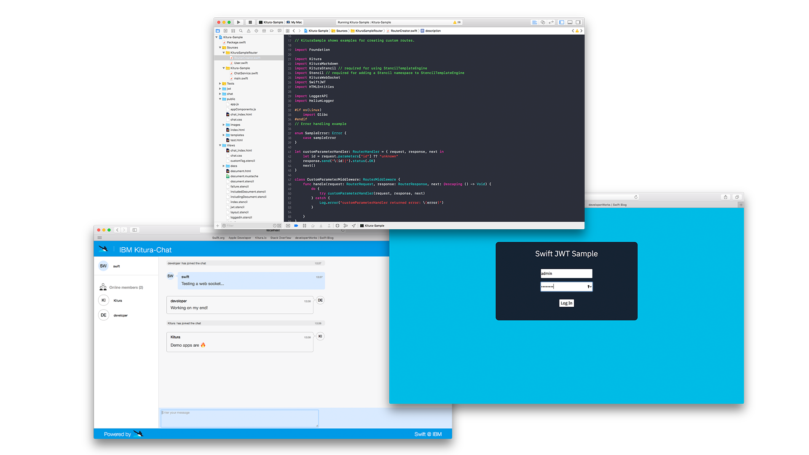

---
### TRANSLATION INSTRUCTIONS FOR THIS SECTION:
### TRANSLATE THE VALUE OF THE title ATTRIBUTE AND UPDATE THE VALUE OF THE lang ATTRIBUTE.
### DO NOT CHANGE ANY OTHER TEXT.
layout: page
title: Kitura Programming Guides
menu: guides
lang: en
redirect_from: "/guides/guides.html"
### END HEADER BLOCK - BEGIN GENERAL TRANSLATION
---

[info]: ../../assets/info-blue.png
[tip]: ../../assets/lightbulb-yellow.png
[warning]: ../../assets/warning-red.png

<h1>Programming Guides</h1>

Learn how to use Kitura and its features using our handy step-by-step guides

    <h1 style="font-size:28px;text-align:center;border-bottom:0px;margin-top:0px;display:block;"><a href="https://kitura-sample-ibm.mybluemix.net">Example Kitura Project</a></h1>
    
View the Kitura Sample project, which includes code examples of loads of Kitura and IBM Swift features.

    
    
<a href="https://github.com/IBM-Swift/Kitura-Sample">View the code on GitHub</a>

    
<a href="https://kitura-sample-ibm.mybluemix.net">Open in IBM Cloud</a>

    <h2>Adding Routing and Requests</h2>
    <h3><a href="/{{ page.lang }}/guides/guides/codablerouting.html">Codable Routing</a></h3>
    
Learn how to use Codable routing to build REST APIs

    
    <h3><a href="/{{ page.lang }}/guides/guides/parsingrequests.html">Parsing Requests</a></h3>
    
Learn how to parse query and URL parameters and also JSON requests.

    <h3><a href="/{{ page.lang }}/guides/guides/responsehandlers.html">Special Types of Response Handlers</a></h3>
    
Learn how to define response handlers for complex routes.

    
    <h3><a href="/{{ page.lang }}/guides/guides/pathsyntax.html">Writing Custom Paths</a></h3>
    
Learn how to define routes using custom paths, including parameters for complex routes.

    
    <h3><a href="/{{ page.lang }}/guides/guides/staticcontent.html">Serving Static Content</a></h3>
    
Learn how to serve static content, such as a static website.

    <h2>Security</h2>
    <h3><a href="/{{ page.lang }}/guides/guides/credentials.html">Adding Authentication with Kitura-Credentials</a></h3>
    
Learn how to add intergration with Facebook OAuth authentication.

    
    <h3><a href="/{{ page.lang }}/guides/guides/sessions.html">Adding Sessions with Kitura-Session</a></h3>
    
Learn how to save user data with a session plugin.

    <h3><a href="/{{ page.lang }}/guides/guides/ssl.html">Enabling SSL/TLS on Kitura</a></h3>
    
Learn how to enable SSL and TLS on Kitura to enhance the security of your application.

    <h2>Monitoring and Diagnostics</h2>
    <h3><a href="/{{ page.lang }}/guides/guides/swiftmetrics.html">Adding Monitoring with Application Metrics for Swift</a></h3>
    
Learn how to add monitoring with Application Metrics for Swift (Swift Metrics) to visualise throughput and performance.

    <h2>Building</h2>
    <h3><a href="/{{ page.lang }}/starter/leveragedocker.html">Building for Linux using macOS</a></h3>
    
Learn how to build your Kitura application in a Linux container on macOS.

    
    <h3><a href="/{{ page.lang }}/starter/xcode.html">Building within Xcode</a></h3>
    
Learn how to build Kitura applications inside Xcode.
 

    <h2>Other Topics</h2>
    <h3><a href="/{{ page.lang }}/guides/guides/templating.html">Using Templating Engines with Kitura</a></h3>
    
This guide shows you how to use popular templating engines such as Mustache and Stencil in Kitura.
 
    
    <h3><a href="/{{ page.lang }}/guides/guides/fastcgi.html">Using FastCGI with Kitura</a> (Linux only)</h3>
    
Kitura on Linux supports FastCGI 1.0 and has been tested with both Nginx and Apache.
 

