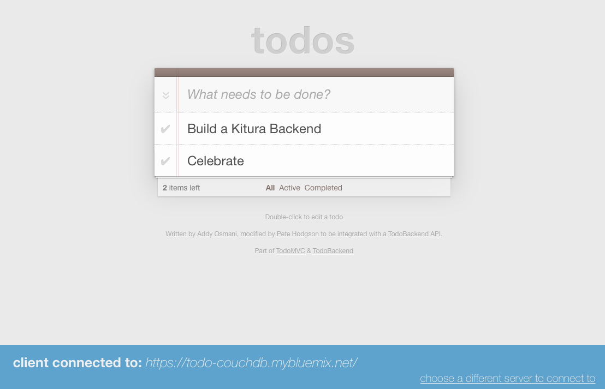
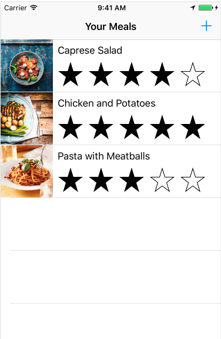

---
### TRANSLATION INSTRUCTIONS FOR THIS SECTION:
### TRANSLATE THE VALUE OF THE title ATTRIBUTE AND UPDATE THE VALUE OF THE lang ATTRIBUTE.
### DO NOT CHANGE ANY OTHER TEXT.
layout: page
title: Kitura Tutorials
menu: resources
lang: en
redirect_from: "/resources/tutorial-todo.html"
### END HEADER BLOCK - BEGIN GENERAL TRANSLATION
---

<h1>Tutorials</h1>

Learn how to use Kitura with these walk-through tutorials

## Build a Kitura back-end application

### [TodoList](https://github.com/IBM/TodoBackend)

Learn how to build a back-end for the TodoList web application.

### [Apple FoodTracker](https://github.com/IBM/FoodTrackerBackend)

Learn how to build a back-end for the Apple FoodTracker iOS application.

---

## Adding Routing and Requests

### [Parsing Requests](/{{ page.lang }}/resources/tutorials/parsingrequests.html)

Learn how to parse query and URL parameters also handle JSON requests.

### [Special Types of Response Handlers](/{{ page.lang }}/resources/tutorials/responsehandlers.html)

Learn how to define response handlers for complex routes.

### [Writing Custom Paths](/{{ page.lang }}/resources/tutorials/pathsyntax.html)

Learn how to define routes using custom paths, including parameters and custom matching with regular expressions.

### [Serving Static Content](/{{ page.lang }}/resources/tutorials/staticcontent.html)

Learn how to serve static content.

---

## Security

### [Adding Authentication with Kitura-Credentials](/{{ page.lang }}/resources/tutorials/credentials.html)

Learn how to add integration with Facebook OAuth authentication.

### [Adding Sessions with Kitura-Session](/{{ page.lang }}/resources/tutorials/sessions.html)

Learn how to save user data with a session plugin.

### [Enabling SSL/TLS on Kitura](/{{ page.lang }}/resources/tutorials/ssl.html)

Learn how to enable SSL/TLS on Kitura to enhance the security of your application.

---

## Monitoring and Diagnostics

### [Adding Monitoring with Application Metrics for Swift](/{{ page.lang }}/resources/tutorials/swiftmetrics.html)

Learn how to add monitoring with Application Metrics for Swift (SwiftMetrics) to visualise throughput and performance.

---

## Building

### [Building for Linux on a Mac](/{{ page.lang }}/starter/leveragedocker.html)

Learn how to build your Kitura application in a Linux container on macOS.

### [Building within Xcode](/{{ page.lang }}/starter/xcode.html)

Learn how to build Kitura applications inside Xcode.

---

## Other Topics

### [Using Templating Engines with Kitura](/{{ page.lang }}/resources/tutorials/templating.html)

This tutorial shows how to use popular templating engines like Mustache and Stencil in Kitura.

### [Using FastCGI with Kitura](/{{ page.lang }}/resources/tutorials/fastcgi.html) (Linux only)

Kitura supports FastCGI 1.0 and has been tested with both Nginx and Apache.

[info]: ../../assets/info-blue.png
[tip]: ../../assets/lightbulb-yellow.png
[warning]: ../../assets/warning-red.png
